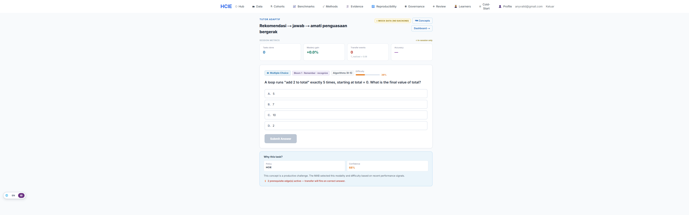
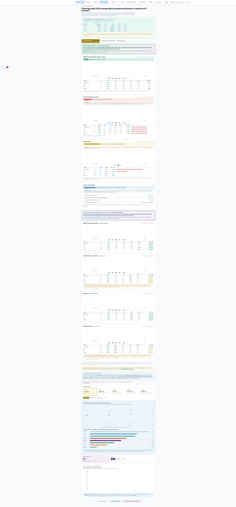
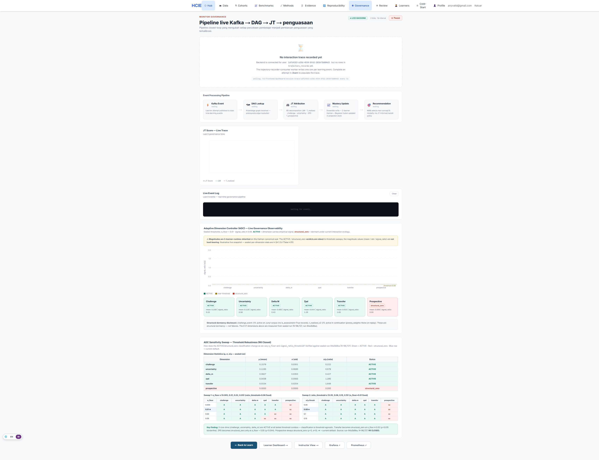
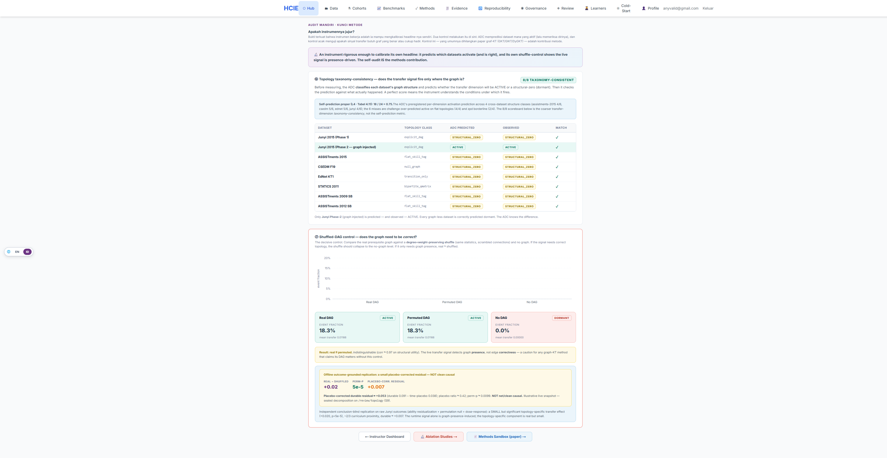
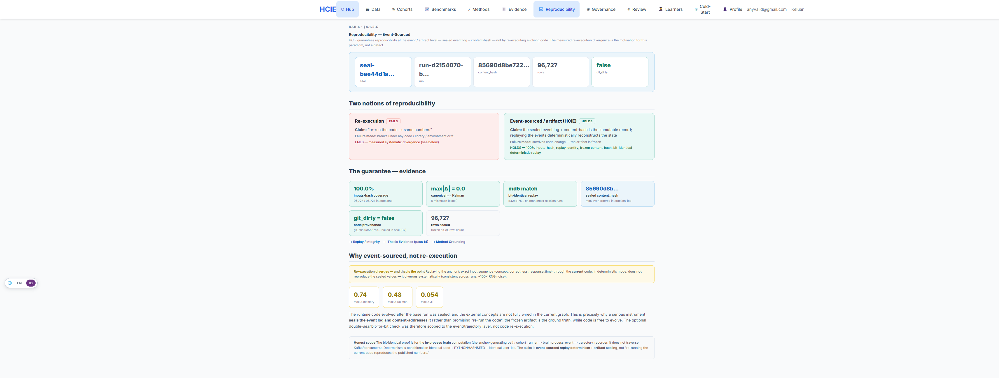
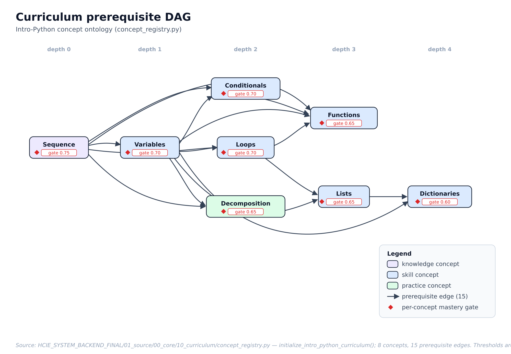
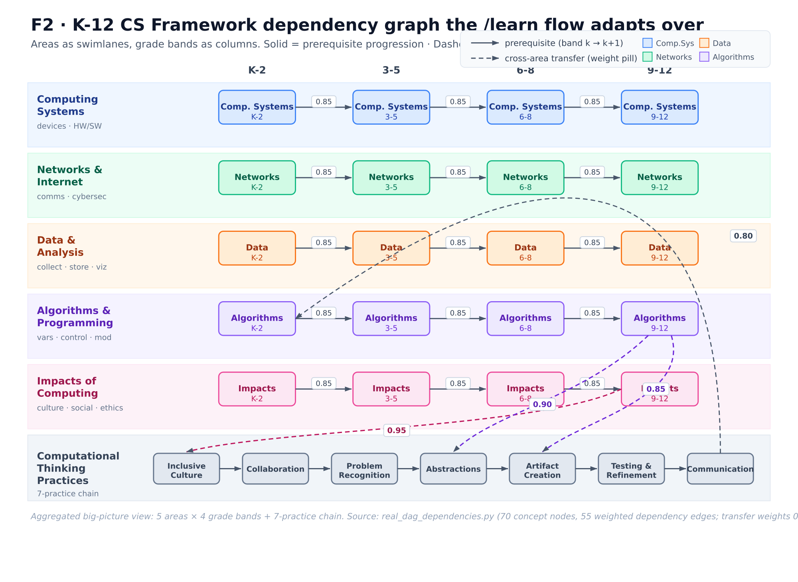

# HCIE — How It Works (one-page tour)

A guided tour of the system: the runtime flow, the directory layout, a hands-on walkthrough, and the API/Postman
setup. For the full operator reference see [MANUAL.md](MANUAL.md); to reproduce the sealed results see
[REPRODUCIBILITY.md](REPRODUCIBILITY.md).

---

## Demo

Screenshots of the running system (sealed-anchor data; captions name the surface):

**Adaptive learn loop** — the closed recommend → attempt → learn cycle; mastery updates live as the learner works.


**Cold-start journey** — lagged-Kalman mastery; leads in the *pooled* aggregate (per-window mixed — BKT competitive at very low N; honest framing in REPRODUCIBILITY.md §5).


**Benchmarks** — HCIE vs knowledge-tracing baselines (BKT / DKT / SAKT) across evaluation windows.


**JT governance** — the 6-dimensional Joint-Task objective + Adaptive Dimension Controller activation.


**Self-audit** — the instrument characterising its own signals (reflexivity).


**Reproducibility** — sealed run, content hash, and the bit-identical determinism check.


---

## 1. How it works (the flow)

HCIE is an **event-sourced adaptive Intelligent Tutoring System** + research instrument. One learner attempt flows
through the whole system like this:

```
 learner attempt                                   ┌─ trajectory-recorder ─► experiment_trajectories (AUC / cold-start)
       │ POST /v3/learner/attempt                  │
       ▼                                           ├─ adaptation-consumer ──► pedagogical adaptations
   [ api ] ──produces──► (Kafka: user-interactions)│
       │                          │                ├─ exploration-instrumentation ─► exploration_events
       │                          ▼                │
       │                 [ learning-consumer ]     ├─ transfer-measurement ─► transfer_events (cross-concept)
       │                  runs UnifiedLearningBrain │
       │                          │ CognitionUpdated▼
       │              (Kafka: learning_analytics) ──┴───────────────►
       │                          │
       │                          ▼
       │                 [ projection-consumer ] ──► learner_projections (read model)
       │                          │ ProjectionUpdated
       │                 (Kafka: projections)
       │                          ▼
       │                 [ projection-stream-gateway ] ──► WebSocket ──► live UI
       ▼
   response (recommendation / mastery)
```

**The brain** (`01_source/00_core`, in `unified_brain.py`): each event updates a learner's mastery via an
**ensemble** (Bayesian + lagged-Kalman + bounded-stability), governed by a **6-dimensional Joint-Task (JT)**
objective under **constitutional bounds**, with a **Thompson-sampling bandit** choosing the next item/modality.
An **Adaptive Dimension Controller (ADC)** characterises which JT signals are actually active.

**The loop:** `recommend → attempt → learn → mastery moves → recommend …` — closed and persisted (write-through to
Postgres + the Kafka projection chain above).

**The research instrument:** runs can be **sealed** (content-hash over the trajectory rows) and the brain
**replayed deterministically** — the determinism harness is bit-identical seed-for-seed, but full live
re-execution is *not* bytewise (see REPRODUCIBILITY.md §6). That makes the results **artifact-level reproducible**.

---

## 1b. The concept graph it adapts over

The brain reasons over an explicit **prerequisite + transfer graph**, not embeddings — that graph is what makes
cold-start possible. Two views below; node-level detail, the causal control, and thesis placement/captions are in
**[docs/FIGURES.md](docs/FIGURES.md)** (SVG canonical + PNG).

**Curriculum prerequisite DAG** — the Intro-Python ontology a learner climbs; an item unlocks only once its
prerequisites clear the per-concept mastery gate (else the API returns `409 concept_locked`).


**Live K-12 CS-framework DAG** — the full dependency graph `/learn` adapts over: 5 areas × 4 grade bands + the
7-step practices chain, with the weighted cross-area **transfer** edges the transfer result (§5 of REPRODUCIBILITY) is measured over.


A node-level zoom of the Algorithms & Programming strand (`docs/figures/F3-algorithms.svg`) and the **shuffled-DAG
causal control** (`docs/figures/F4-causal.svg` — the evidence behind the "transfer is correlational, *not* causal"
caveat) are in [docs/FIGURES.md](docs/FIGURES.md).

---

## 2. Directory layout

```
hcie-system/
├── Makefile                     # one-command lifecycle (up/migrate/seed/test/verify/reseal/backup)
├── README.md  MANUAL.md  REPRODUCIBILITY.md  HOW_IT_WORKS.md  CHANGELOG.md  CITATION.cff
├── .env.example                 # copy to .env; set ADMIN_PASSWORD + JWT_SECRET_KEY
├── scripts/                     # run_tests.sh · run_determinism_parity.sh · golden_gate.sh · gen_postman.sh
├── postman/                     # openapi.json (source) + HCIE.postman_collection.json
│
├── HCIE_SYSTEM_BACKEND_FINAL/   # the backend (numbered "NASA-grade" layout)
│   ├── 01_source/               #   the live app
│   │   ├── 00_core/             #     the brain: mastery/Kalman, ensemble, ADC, 6-D JT, bandit (unified_brain.py)
│   │   ├── 01_application/      #     FastAPI app (app.main:app), the 7 event workers, runtime services, DI
│   │   └── 02_infrastructure/   #     storage (Postgres/Redis), messaging/outbox
│   ├── 02_tests/                #   pytest suite (unit · integration · behavioral · research · safety · …) + golden master
│   ├── 03_scripts/              #   01_ops (seeders) · 01_maintenance (reseal CLI) · 02_analysis (dep-graph, audit)
│   ├── 04_config/00_schemas/    #   settings.py (pydantic Settings)
│   ├── 05_deployment/00_docker/ #   the compose + Dockerfiles (THE stack)
│   ├── 06_monitoring/           #   Prometheus/Grafana/Alertmanager/Tempo/OTEL configs
│   ├── 07_database/00_migrations/ # the Alembic chain (schema + idempotent curriculum seeds) + 00_seeds/seed.py
│   ├── 08_security/             #   FERPA/GDPR/PII scanners + audit schema
│   ├── 10_tools/                #   dev linters
│   ├── 11_build/00_runtime_projection/  # sitecustomize.py — maps clean module names → numbered dirs (the boot path)
│   └── config/                  #   endpoint_authority_manifest.yaml (357-route classification)
│
└── HCIE_SYSTEM_FRONTENDV3/      # the frontend (Next.js 16, app-router)
    └── src/{app,components,lib,contexts,hooks}  # live UI: learn loop, dashboards, sealed /review portal
```
(Quality tooling: `03_scripts/02_analysis/dep_graph_analysis.py` = Tarjan-SCC circular-dep + orphan detector; CI in `.github/workflows/`.)

---

## 3. Walkthrough (using the manual)

Follow [MANUAL.md](MANUAL.md) — the short version:

1. **Set up** — `cp HCIE_SYSTEM_BACKEND_FINAL/05_deployment/00_docker/01_compose/.env.example .env`, set `ADMIN_PASSWORD` + `JWT_SECRET_KEY`.
2. **Build + start** — `make build && make up` → api on **:8011**, Postgres **:55432**, Redis **:56379**, Redpanda **:19092**, 7 workers.
3. **Schema + data** — `make migrate` (Alembic chain seeds the K-12 curriculum/concepts/tasks) then `make seed` (admin/tenant).
4. **Use it** — `make fe-build` then bring up the frontend profile; open the UI, register/login, run the **learn loop** (recommend → attempt → watch mastery move). The sealed `/review/*` portal renders the thesis evidence.
5. **Observe** — `--profile observability` → Grafana **:3000** (admin/admin); `--profile tracing` → Tempo/Loki/Pyroscope.
6. **Verify** — `make test` (functional suite, isolated stack) and `make verify` (suite + **bit-identical determinism parity**, expect md5 `3ab07694…`).
7. **Operate** — `make reseal RUN=<id>` (seal a run) · `make backup` (off-box pg_dump) · `make logs` / `make ps`.

To explore the architecture as a **graph**, the codebase ships an Understand-Anything knowledge graph at
`.understand-anything/knowledge-graph.json` (1,636 nodes / 14 layers) — open it with the dashboard skill.

---

## 4. API & Postman

The API is FastAPI, so the **OpenAPI spec is auto-generated** from the route code and served at
`http://localhost:8011/openapi.json` (354 operations, 18 groups). This repo ships:

- `postman/openapi.json` — the spec snapshot (source of truth).
- `postman/HCIE.postman_collection.json` — a ready-to-import Postman v2.1 collection.

**How the Postman collection stays updated:** it is *generated from the live OpenAPI*, never hand-maintained. When
the API routes change, regenerate it:
```bash
make up                      # API must be running
bash scripts/gen_postman.sh  # curls /openapi.json -> converts -> postman/HCIE.postman_collection.json
```
Then re-import in Postman (**Import → File**), or use **Import → Link** on `openapi.json` so Postman re-syncs the
collection automatically whenever the spec changes. Set a Postman environment variable `baseUrl =
http://localhost:8011` and authenticate via `POST /auth/login` (the collection's requests use `{{baseUrl}}`).
