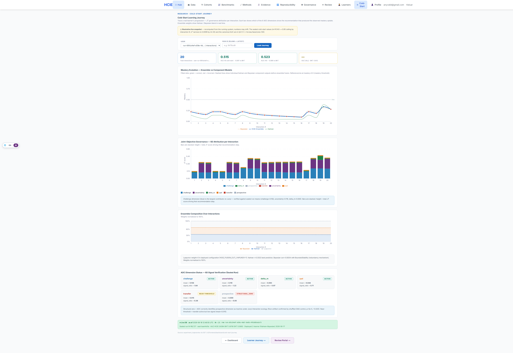

# HCIE — Clean Code Evidence Bundle

[](#status)
[](https://www.repostatus.org/#active)
[](https://github.com/farroshsy/hcie-system/actions/workflows/ci.yml)
[](LICENSE)
[](https://www.python.org/)
[](https://nodejs.org/)
[](REPRODUCIBILITY.md)

A cleaned, **runnable** export of the live HCIE system (an event-sourced, cold-start, embedding-free
Intelligent Tutoring System + research instrument). Legacy/dead/duplicate code, build artifacts, docs, data
dumps, and secrets have been removed; the result is a self-contained product you can
build, run, migrate, and verify anywhere.

Stack: FastAPI · PostgreSQL · Redis · Kafka/Redpanda (outbox→CQRS projection) · Next.js. Two trees kept as
siblings so the compose build-contexts + mounts resolve: `HCIE_SYSTEM_BACKEND_FINAL/` + `HCIE_SYSTEM_FRONTENDV3/`.

**Start here:** [HOW_IT_WORKS.md](HOW_IT_WORKS.md) — architecture tour + directory map + walkthrough · [MANUAL.md](MANUAL.md) — operate · [REPRODUCIBILITY.md](REPRODUCIBILITY.md) — replicate from scratch · [docs/FIGURES.md](docs/FIGURES.md) — concept-graph & causal-control figures · [postman/](postman/) — importable API collection.


<sub>Cold-start mastery (lagged-Kalman proxy): leads in the <em>pooled</em> aggregate; per-window it's mixed — BKT is competitive/better at very low N. Honest framing in <a href="REPRODUCIBILITY.md">REPRODUCIBILITY.md §5</a>. More in the <a href="HOW_IT_WORKS.md#demo">Demo</a>.</sub>

## Quickstart
```
make init        # create .env (set ADMIN_PASSWORD, JWT_SECRET_KEY) + the data-dir mounts the compose needs
make build       # build api + worker images
make fe-build    # build the Next.js frontend image
make up          # start the full stack (api + 7 workers + Postgres/Redis/Kafka)
make migrate     # apply Alembic migrations (07_database) → schema
make verify      # functional suite (isolated stack) + bit-identical determinism parity
make logs / ps / down / clean
```
Requires Docker + Docker Compose. `make help` lists all targets.

## Directory intent map
**`HCIE_SYSTEM_BACKEND_FINAL/`**
- `01_source/` — the live application. `00_core` = the brain (mastery/Kalman, ensemble, ADC governance, 6-D JT, bandit); `01_application` = API (`app.main:app`), the 7 event consumers/workers, runtime services; storage / messaging / infrastructure.
- `02_tests/` — pytest suite (unit · integration · behavioral · research · safety · performance · security · compliance) + `golden/` master. **The checkability layer: 398 passed / 28 skipped / 0 failed** on an isolated stack.
- `03_scripts/01_ops` + `02_analysis` — operational scripts (cutover data init / seeder; live worker-pipeline audit).
- `04_config/00_schemas/settings.py` — runtime pydantic `Settings`. `config/endpoint_authority_manifest.yaml` — endpoint authority classification (consumed by tests).
- `05_deployment/00_docker` — the compose + Dockerfiles (build/run definition); `01_ci_cd` / `02_cloudflare` / `02_terraform` — deploy config.
- `06_monitoring/` — Grafana / Prometheus / Dozzle configs (wired into compose).
- `07_database/00_migrations/{versions,alembic.ini,env.py}` — the **Alembic chain (33 revisions)** = schema + re-seed path.
- `08_security/` — security config/policies.
- `11_build/00_runtime_projection/sitecustomize.py` — **the boot path**: maps clean module names (`core.*`, `app.*`) → the numbered source tree.
- `pyproject.toml` · `pytest.ini` · `requirements-compliance.txt` — build/dep/tooling config.

**`HCIE_SYSTEM_FRONTENDV3/`** (Next.js 16, app-router)
- `src/app/` — the live UI surface (learn loop, dashboards, sealed `/review/*` portal). `src/components/` · `src/lib/{ui,api,core,…}` · `src/contexts` · `src/hooks` — live component + library + context layers. `src/proxy.ts` — auth/rate-limit middleware.
- `src/data/thesis_extracts/` — build-time copy of the sealed extracts. `public/` — sealed paper artifacts (`data/adc/*.json`). `messages/` — i18n. `src/mocks/` — MSW (dev only).
- `package.json` · `next.config.js` · `tsconfig.json` · `tailwind/postcss` · `Dockerfile` · `eslint.config.mjs` — build/run config. `.env.example` — env template.

## How it's verified (fully checkable)
- **Backend**: `compileall` clean; functional suite **398 passed / 28 skipped / 0 failed** (`make test`, on the isolated docker stack); bit-identical deterministic replay at md5 `3ab07694…` (`make verify`); Bandit **0 HIGH**.
- **Frontend**: `npm ci` + `next build` compiles clean from this tree (exit 0) — the safety gate.

## Provenance (the sealed run this code produces)
Canonical anchor **`seal-bae44d1a`** / **`run-d2154070`** · content_hash `85690d8b…` · 96,727 rows. The
content_hash proves **row-identity** of the frozen run (md5 over the trajectory ids); `make reseal` returns it
idempotently. Headline this code generates: cold-start AUC (lagged-Kalman **proxy**, tie-aware / sklearn) **0.6051 pooled-overall** —
leads *in the pooled aggregate* (BKT 0.5963; HCIE−BKT significant at n=76, 95% CI [+0.0017, +0.0226]); **per-window mixed** (BKT competitive at very low N — see REPRODUCIBILITY.md §5).
Transfer = placebo-corrected residual **+0.053** (correlational over a static prerequisite DAG, **not causal**);
ADC self-characterization L4 18/24. Reproducibility is **artifact-level** (content-hash seal + deterministic-harness
replay), **not** bytewise re-execution of the live pipeline.

## Status
**Research & Development — active.** This is a research instrument from a thesis, not a productised release: the
system builds, runs, and is **reproducible** (bit-identical deterministic replay; sealed anchor), and is under active
development. It is *research-grade*, not production-supported — APIs and internals may change, and it carries no
uptime/SLA or backward-compatibility guarantees. Use it to reproduce, study, and build on the results.

## Author & License
**Author:** Farros Hilmi Syafei · [@farroshsy](https://github.com/farroshsy) · farrossyafei.205025@mhs.its.ac.id
(Institut Teknologi Sepuluh Nopember).

Licensed under the **MIT License** — see [LICENSE](LICENSE). © 2026 Farros Hilmi Syafei.
