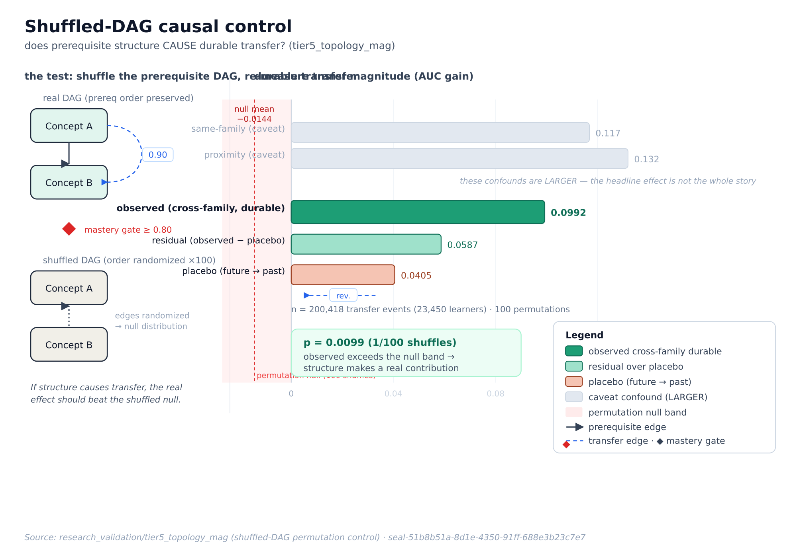

# HCIE — Reproducibility Guide

This document lets an independent researcher **reproduce the deterministic brain results and verify the sealed
artifacts** with no access to the original machine. Three mechanisms support it: a deterministic execution mode
(fixed seed), content-hash–sealed artifacts, and version-pinned container images. Each check below has an
**expected value**. Read §6 (Scope & limits) — the guarantees are specific, not blanket.

## 1. Environment
- **Docker + Docker Compose** + GNU Make. Nothing else on the host.
- Image pinning is **mixed**: the API/worker + most observability images are `sha256:`-digest pinned; the
  datastores (`postgres:15-alpine`, `redpandadata/redpanda:v23.x`, `grafana/k6:latest`) are currently **tag-pinned**,
  so the environment is *tag-reproducible*, not bit-reproducible, for those services. (Digest-pinning them is tracked.)
- API/worker image: Python **3.10** (`Dockerfile.cutover`); frontend: Node **20**.
- Determinism knobs (set by the harnesses): `ENABLE_DETERMINISTIC_MODE=true`, `DETERMINISTIC_SEED=42`, `PYTHONHASHSEED=0`.

## 2. From scratch (no original data needed)
```bash
make init                 # .env from template (set ADMIN_PASSWORD, JWT_SECRET_KEY) + mount dirs
make build && make up     # build images, start stack (api 8011, pg 55432, redis 56379, kafka 19092)
make migrate              # apply the Alembic chain -> schema + idempotent curriculum/task seeds
make seed                 # bootstrap admin/tenant
make verify               # functional suite + deterministic-replay parity (see §3)
```
Schema + curriculum/concept/task data are **seeded by the Alembic chain** (`009_seed_k12_concepts … 033_…`), so a
fresh DB is fully populated and you can run the system + reproduce the *deterministic brain* outputs. The **original
sealed research rows** are a separate 1.3 GB dump (not in this repo) — restore them with
`HCIE_SYSTEM_BACKEND_FINAL/05_deployment/03_data_portability/import_db.sh` if you need the exact anchor table.

## 3. Reproducibility checks (with expected values)

| # | Check | Command | Expected |
|---|---|---|---|
| 1 | **Deterministic brain replay** — runs the brain harness twice in fresh processes, compares md5 | `make parity` | both runs md5 = **`3ab07694eabe0ad52c6378065cf23100`** → `BIT-IDENTICAL ✓` |
| 2 | **Brain golden master** — fixed 7-event sequence, 12 snapshot fields | `bash scripts/golden_gate.sh` vs `02_tests/golden/unified_brain_golden.json` | snapshot matches the committed golden |
| 3 | **Sealed anchor** — the canonical research run | `make reseal RUN=<anchor_run_id>` (idempotent) | `seal-bae44d1a` · content_hash **`85690d8b…`** · **96,727** rows |
| 4 | **Functional suite** | `make test` | pytest green on the isolated stack (never the live DB) |

`make verify` runs #1 + #4. **Scope of #1:** it hashes the brain harness's 12 output fields over a fixed 7-event
sequence (rounded to 9 dp) — it proves the *brain math* is deterministic and reproducible seed-for-seed. It does
**not** mean the entire event-sourced pipeline re-executes bytewise (see §6).

## 4. The sealed anchor (what you are reproducing)
Canonical seal **`seal-bae44d1a`** / run **`run-d2154070`** · content_hash `85690d8b…` over 96,727 trajectory rows.
The content-hash proves **row-identity** of the frozen run (it is an md5 over the trajectory ids), and `make reseal`
returns the same manifest idempotently. It does **not** by itself prove value-reproducibility of every field.

## 5. Headline results (stated honestly)
- **Cold-start AUC (lagged-Kalman proxy, tie-aware / sklearn): 0.6051 pooled-overall, which leads the baselines (BKT 0.5963) *in the pooled aggregate*; HCIE−BKT significant at n=76 (95% CI [+0.0017, +0.0226]).**
  Per-cold-start-window the picture is **mixed** — BKT is competitive and beats HCIE in the smallest-N windows
  (e.g. n≤10). The pooled headline is therefore partly a Simpson's-paradox aggregate; cite it *with* the per-window
  table, not instead of it. The predictor is a lagged-Kalman proxy, not the system's shipped mastery output.
- **Transfer = a placebo-corrected residual (+0.053)** measured over a static prerequisite DAG with shuffled-DAG
  null controls. It is **correlational/topological**, not causal inference (no intervention/counterfactual).

  
  <sub>The shuffled-DAG control: observed cross-family durable transfer **0.0992** vs future→past placebo **0.0405**
  (residual 0.0587), permutation **p=0.0099** over 100 shuffles. Proximity (**0.132**) and same-family (**0.117**)
  confounds are <em>larger</em> than the cross-family effect — real, but not cleanly causal. Run on a 1/10 sample
  (`tier5_topology_mag.json`, seal-51b8b51a); corroborates but ≠ the anchor's +0.053. Full set: <a href="docs/FIGURES.md">docs/FIGURES.md</a>.</sub>

## 6. Scope & limits (read this)
- "Bit-identical" applies to the **deterministic brain harness** (§3 #1), not to full live re-execution: the
  project's event-sourced report shows real anchor re-execution can diverge materially — timing/ordering is not
  frozen. Reproducibility here is **artifact-level** (sealed hash + deterministic harness), not bytewise pipeline replay.
- Datastore images are tag-pinned (§1), so cross-machine reproduction is tag-level for those services.
- The headline AUC is a pooled aggregate on a proxy predictor (§5) — do not read it as "wins every cold-start cell".

## 7. Transparency / long-term execution
- **CI** (`.github/workflows/`): a **Bandit HIGH-severity gate is blocking** (currently 0 HIGH after the MD5 fix);
  CodeQL/Semgrep/radon/vulture + `dep_graph_analysis.py` (Tarjan-SCC, **0 real circular deps**) run and emit SARIF
  but are **informational**, not blocking. Don't read their output as an enforced pass except the Bandit HIGH gate.
- **Provenance** is stamped into every seal (`run_sealing._code_provenance`: git-sha / build-time).
- **Operate** via the `Makefile`; full capability + per-dir coverage map in `MANUAL.md`; architecture tour in `HOW_IT_WORKS.md`.
